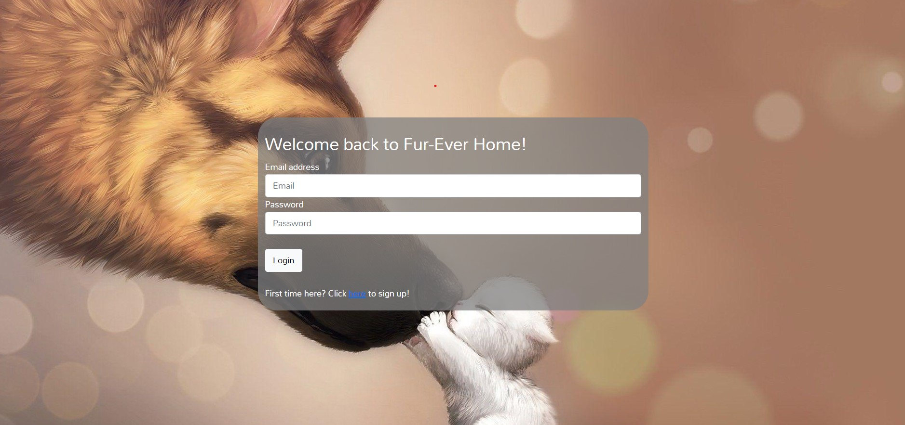

# Project-2 Fur-EVER Home

     

## Table of Contents

- [Project-2 Fur-EVER Home](#project-2-fur-ever-home)
  - [Table of Contents](#table-of-contents)
    - [Project Description](#project-description)
    - [Installation](#installation)
    - [Collaborators](#collaborators)
    - [Credits](#credits)
    - [License](#license)

### Project Description

We developed this project as part of UCSD's web development bootcamp. The goal of the project was to build a node based application that utilized our own database, handlebars to display the HTML, and could easily GET and POST data from and to the client side. 
User story:
AS A non-profit per adoption agency wanting to handle customer database entries directly
I WANT a easy to use, nice looking website for my business
SO THAT potential adoptees can browse available animals and get in contact with sellers directly and safely

### Installation

[Click here to view the deployed project on Heroku](https://oursuperduperawesomeproject2.herokuapp.com/)

### Collaborators
[Terrance Hutchinson](https://github.com/TJH1992),
[Nick Menotti](https://github.com/Nmenotti20),
[Evan Alioto](https://github.com/AlignSD),
[Dillon Hoban](https://github.com/dillonhoban)

### Credits

Special thanks to the following resources that develop this project:

<ul>
<li> My-SQL-Cheat Sheet<https://websitesetup.org/mysql-cheat-sheet/> </li>
<li> NPM MySQL<https://www.npmjs.com/package/mysql> </li>

<li> Express Handlebars<https://www.npmjs.com/package/express-handlebars> </li>
</li>
</ul>
Additional thank you to Peter, Steph, and TA Brian for the support and assistance.

### License

This project is [MIT](https://choosealicense.com/licenses/mit) licensed. 

<i>
Copyright © 2021  

<i>
Please contact us for additional information 
